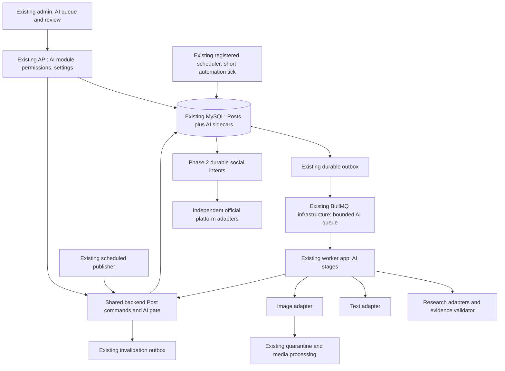
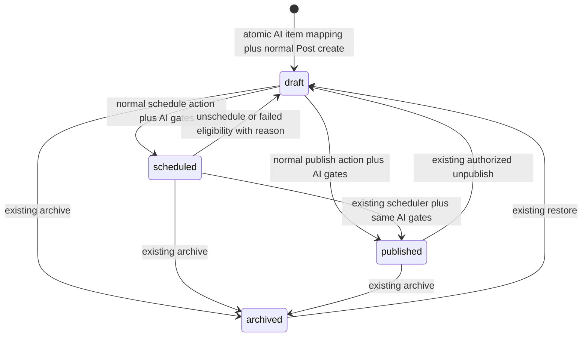

# AI Blog Automation and Social Media Automation — isolated implementation plan

**Status: proposed, awaiting owner approval. Planning only.** Repository inspected 18 September 2026. No application code, schema, configuration, dependencies or runtime data changed; no tests, migrations or deployments run. Earlier whole-Sphere planning is outside this plan and supplies no implementation backlog here.

**Product authority:** [AI Automation master SRS](/Users/nileshkushvaha/Sites/nodejs/adelaide-sphere/docs/Adelaide_Sphere_AI_Content_Automation_Master_SRS_v1.0.docx), plus the owner's latest instructions. **Implementation authority:** the actual repository. The existing Sphere SRS remains the contract for reused blogging, security and operational behaviour; it is not a request to complete the whole application. Phase 2 is designed here but may start only after Phase 1 is stable in production, its acceptance criteria pass, and the owner approves proceeding.

The repository also contains a [Markdown copy of the AI SRS](/Users/nileshkushvaha/Sites/nodejs/adelaide-sphere/docs/adelaide_sphere_ai_content_automation_srs.md), which appeared during this review. Its substantive text was compared with the DOCX extraction: the requirements match; §6 contains an extra “me” in “title mode and me approval mode,” treated as a transcription typo, not a new rule. Neither source was changed.

The companion [requirement matrix](/Users/nileshkushvaha/Sites/nodejs/adelaide-sphere/docs/planning/ai-automation-requirement-matrix.md) maps every substantive source paragraph/table row, the owner's additional instructions, implementation components, steps and required verification. Source paragraph identifiers are planning identifiers, not IDs supplied by the author. The matrix preserves compound requirements in full.

## A. Current-state audit and bounded integration surface

Static evidence below establishes reuse and gaps. Existing test files are evidence of test infrastructure, **not evidence that a suite passed in this session**. No production credentials, live social accounts, provider access or deployment readiness were inspected. Those are release checks, not assumed capabilities.

### Component and path catalogue

These identifiers are also the file/module references in the traceability matrix. Paths under a **Proposed** label do not exist yet and are not claimed as implemented.

| ID | Existing files/components and inspected behaviour | Necessary extension / confirmed gap |
|---|---|---|
| E1 Blog persistence | [packages/database/prisma/schema.prisma](/Users/nileshkushvaha/Sites/nodejs/adelaide-sphere/packages/database/prisma/schema.prisma): `Post`, `Author`, `BlogCategory`, `BlogTag`, `PostTag`, `ContentRevision`, `PostAutosave`; Post has draft/scheduled/published/archived, version, scheduling dates, source/sanitized body, excerpt, SEO, cover/share images and FULLTEXT title/excerpt/searchText. | Keep this canonical model. No AI item/run/evidence/budget/social entities were found in the inspected schema. Add provenance and workflow sidecars, not another article table. `guestPost` is unrelated and must not identify AI content. |
| E2 Blog commands | [apps/api/src/blog/blog.service.ts](/Users/nileshkushvaha/Sites/nodejs/adelaide-sphere/apps/api/src/blog/blog.service.ts): `createPost`, `updatePost`, `restoreRevision`, preview and transitions; expectedVersion checks, sanitizer, media references, taxonomy checks, revisions, publication events/cache invalidation. [apps/api/src/blog/blog.controller.ts](/Users/nileshkushvaha/Sites/nodejs/adelaide-sphere/apps/api/src/blog/blog.controller.ts): distinct edit and publish permissions. | Add AI-only provenance/version/approval gates and atomic item-to-Post creation. Existing methods own transactions and cannot simply be nested inside a worker transaction. Preserve HTTP methods and ordinary-post semantics. Some existing blog audit writes occur after the transaction; consequential new AI actions need transactional audit. |
| E3 Shared publication rules | [packages/domain/src/posts.ts](/Users/nileshkushvaha/Sites/nodejs/adelaide-sphere/packages/domain/src/posts.ts), [apps/api/src/blog/post-rules.ts](/Users/nileshkushvaha/Sites/nodejs/adelaide-sphere/apps/api/src/blog/post-rules.ts): title, excerpt, body, slug, active author/category, explicit actions. [apps/api/src/blog/sanitise.ts](/Users/nileshkushvaha/Sites/nodejs/adelaide-sphere/apps/api/src/blog/sanitise.ts): existing Markdown/HTML sanitization and supported embeds. | Existing checklist has no research, AI approval, image-policy or budget gate. Add an AI sidecar guard in both publication paths, while retaining existing checklist. No invented FAQ schema or second editor format. |
| E4 Worker and scheduler | [apps/worker/src/main.ts](/Users/nileshkushvaha/Sites/nodejs/adelaide-sphere/apps/worker/src/main.ts), [apps/worker/src/schedule-runner.ts](/Users/nileshkushvaha/Sites/nodejs/adelaide-sphere/apps/worker/src/schedule-runner.ts), [apps/worker/src/scheduled-tasks.ts](/Users/nileshkushvaha/Sites/nodejs/adelaide-sphere/apps/worker/src/scheduled-tasks.ts), [packages/domain/src/scheduled-tasks.ts](/Users/nileshkushvaha/Sites/nodejs/adelaide-sphere/packages/domain/src/scheduled-tasks.ts), [packages/domain/src/queue.ts](/Users/nileshkushvaha/Sites/nodejs/adelaide-sphere/packages/domain/src/queue.ts). BullMQ worker and code-registered tasks already exist. Scheduled publisher performs status/version-guarded updates, audit and invalidation. | Add short registered automation ticks and bounded AI stage consumers in this worker app. Scheduled publisher currently does not emit `post.published`, unlike E2. Its publication path must share AI gates and durable publication identity. Existing Redis schedule locks alone are not AI correctness guarantees; timeout wrappers do not establish cancellation of external work. |
| E5 Outbox/cache | [apps/api/src/outbox/outbox.service.ts](/Users/nileshkushvaha/Sites/nodejs/adelaide-sphere/apps/api/src/outbox/outbox.service.ts), [apps/api/src/outbox/outbox.dispatcher.ts](/Users/nileshkushvaha/Sites/nodejs/adelaide-sphere/apps/api/src/outbox/outbox.dispatcher.ts), [apps/api/src/outbox/queue.port.ts](/Users/nileshkushvaha/Sites/nodejs/adelaide-sphere/apps/api/src/outbox/queue.port.ts), [apps/api/src/cache/cache.service.ts](/Users/nileshkushvaha/Sites/nodejs/adelaide-sphere/apps/api/src/cache/cache.service.ts), [apps/worker/src/cache-invalidation.ts](/Users/nileshkushvaha/Sites/nodejs/adelaide-sphere/apps/worker/src/cache-invalidation.ts). Transactional outbox and worker invalidation already exist. | Dispatcher currently maps enquiry, media and cache events; unknown types, including publication events, are marked dispatched. Add explicit automation event consumers; do not depend on replaying old dispatched publication events. Retain cache tags and namespace behaviour. |
| E6 Retrieval | [apps/api/src/blog/blog-public.service.ts](/Users/nileshkushvaha/Sites/nodejs/adelaide-sphere/apps/api/src/blog/blog-public.service.ts) uses MySQL boolean FULLTEXT and published-only projections; resolves published business embeds. E1 supplies searchable text and taxonomy relations. | New bounded internal context projection and novelty checks. Public search does not itself provide semantic dedupe, durable reservations, event identity or a research verifier. No vector database is needed to start. |
| E7 Media | [apps/api/src/media/media.service.ts](/Users/nileshkushvaha/Sites/nodejs/adelaide-sphere/apps/api/src/media/media.service.ts) upload/complete/usable-image checks; [apps/api/src/media/content-media.ts](/Users/nileshkushvaha/Sites/nodejs/adelaide-sphere/apps/api/src/media/content-media.ts) transaction-aware body references; [apps/worker/src/media-processing.ts](/Users/nileshkushvaha/Sites/nodejs/adelaide-sphere/apps/worker/src/media-processing.ts), [apps/worker/src/s3-storage.ts](/Users/nileshkushvaha/Sites/nodejs/adelaide-sphere/apps/worker/src/s3-storage.ts); E1 MediaAsset quarantine/status/checksum/variants/credit/rights and nullable uploader. | Add a server-produced asset intake using this pipeline and AI operation metadata. Never attach raw provider URLs. Existing library, uploads, variants, reference tracking and retention remain authoritative. |
| E8 Settings | [apps/api/src/settings/registry.ts](/Users/nileshkushvaha/Sites/nodejs/adelaide-sphere/apps/api/src/settings/registry.ts), [apps/api/src/settings/settings-store.service.ts](/Users/nileshkushvaha/Sites/nodejs/adelaide-sphere/apps/api/src/settings/settings-store.service.ts), [apps/api/src/settings/settings.service.ts](/Users/nileshkushvaha/Sites/nodejs/adelaide-sphere/apps/api/src/settings/settings.service.ts); one `(group,key)` Setting table, typed ownership, document primitives, audit/invalidation. | Add owned `ai_content` and later `social` declarations and validated documents. No AI settings table. **Inspected concurrency issue relevant to this integration:** writeDocument checks version before the transaction, then updates without a version predicate. Implement transaction-level compare-and-set for the new safety-critical writes through this store; smallest shared-store correction is preferable to a duplicate settings writer. Verify old callers retain behaviour. |
| E9 Authorization/audit | [apps/api/src/identity/permissions.ts](/Users/nileshkushvaha/Sites/nodejs/adelaide-sphere/apps/api/src/identity/permissions.ts), [apps/api/src/audit/audit.service.ts](/Users/nileshkushvaha/Sites/nodejs/adelaide-sphere/apps/api/src/audit/audit.service.ts), [apps/api/src/audit/activity-catalogue.ts](/Users/nileshkushvaha/Sites/nodejs/adelaide-sphere/apps/api/src/audit/activity-catalogue.ts), [apps/api/src/audit/activity-scope.ts](/Users/nileshkushvaha/Sites/nodejs/adelaide-sphere/apps/api/src/audit/activity-scope.ts). Existing default-deny admin chain, permission catalogue and activity feed. | Register AI/social capabilities and event labels/scopes. Reuse AuditLog and transactional recordWith; no second activity system. Worker actor is a system actor with originating admin reference, never a fabricated administrator session. |
| E10 Admin | [apps/admin/src/app/routes.tsx](/Users/nileshkushvaha/Sites/nodejs/adelaide-sphere/apps/admin/src/app/routes.tsx), [apps/admin/src/layouts/AdminShell.tsx](/Users/nileshkushvaha/Sites/nodejs/adelaide-sphere/apps/admin/src/layouts/AdminShell.tsx), [apps/admin/src/api/data-provider.ts](/Users/nileshkushvaha/Sites/nodejs/adelaide-sphere/apps/admin/src/api/data-provider.ts), [apps/admin/src/auth/permissions.ts](/Users/nileshkushvaha/Sites/nodejs/adelaide-sphere/apps/admin/src/auth/permissions.ts), [apps/admin/src/auth/access-control.ts](/Users/nileshkushvaha/Sites/nodejs/adelaide-sphere/apps/admin/src/auth/access-control.ts), [apps/admin/src/auth/CapabilityProvider.tsx](/Users/nileshkushvaha/Sites/nodejs/adelaide-sphere/apps/admin/src/auth/CapabilityProvider.tsx), [apps/admin/src/pages/blog/PostEditorPage.tsx](/Users/nileshkushvaha/Sites/nodejs/adelaide-sphere/apps/admin/src/pages/blog/PostEditorPage.tsx). Existing Refine/Ant editor and capability-driven shell. | Add AI queue/evidence/history/settings views; use existing editor/preview for writing. Add small AI provenance/gate panel in Post editor. No new admin application. |
| E11 Contracts/verification | [packages/contracts](/Users/nileshkushvaha/Sites/nodejs/adelaide-sphere/packages/contracts), [apps/api/test](/Users/nileshkushvaha/Sites/nodejs/adelaide-sphere/apps/api/test), [e2e](/Users/nileshkushvaha/Sites/nodejs/adelaide-sphere/e2e), existing adjacent `.spec.ts` and admin tests. | Add API contracts, scoped tests and controlled UAT; no test execution authorized by this planning request. |
| E12 Observability | [apps/worker/src/observability.ts](/Users/nileshkushvaha/Sites/nodejs/adelaide-sphere/apps/worker/src/observability.ts), [apps/worker/src/heartbeat.ts](/Users/nileshkushvaha/Sites/nodejs/adelaide-sphere/apps/worker/src/heartbeat.ts), [apps/worker/src/log.ts](/Users/nileshkushvaha/Sites/nodejs/adelaide-sphere/apps/worker/src/log.ts), [packages/domain/src/alerts.ts](/Users/nileshkushvaha/Sites/nodejs/adelaide-sphere/packages/domain/src/alerts.ts), existing operations UI/notification conventions. | Add AI oldest-waiting/unknown-outcome/fact-review/budget metrics, bounded labels, actionable alerts and recovery tools. Do not redesign unrelated monitoring or backup work. |
| N1 Proposed orchestration | **Proposed:** `/Users/nileshkushvaha/Sites/nodejs/adelaide-sphere/apps/api/src/ai-content/` (module/controllers/DTOs/settings/topic/review services); `/Users/nileshkushvaha/Sites/nodejs/adelaide-sphere/packages/domain/src/ai-content.ts` (pure transitions/contracts/policies). | New feature domain, extending current apps. No provider SDK or database access in the browser-facing pure domain. |
| N2 Proposed durable backend operations | **Proposed:** `/Users/nileshkushvaha/Sites/nodejs/adelaide-sphere/packages/database/src/automation/` (repository, reservations, leases, ledger); `/Users/nileshkushvaha/Sites/nodejs/adelaide-sphere/packages/database/src/editorial/` (small transaction-aware Post command/sanitizer/media-reference seam shared by API/worker). | Reuse the existing backend-only database package, avoiding a new project/package. Extract only code necessary for these paths; retain E2/E3/E7 entrypoints as delegates/re-exports. No generic repository framework. |
| N3 Proposed execution/providers | **Proposed:** `/Users/nileshkushvaha/Sites/nodejs/adelaide-sphere/apps/worker/src/ai-content/` (research, generation, images, provider adapters, recovery). | External network calls remain in worker stages outside DB transactions. Existing API owns administration; worker owns processing. |
| N4 Proposed admin UI | **Proposed:** `/Users/nileshkushvaha/Sites/nodejs/adelaide-sphere/apps/admin/src/pages/ai-content/`, `/Users/nileshkushvaha/Sites/nodejs/adelaide-sphere/apps/admin/src/api/ai-content.ts`. | Dedicated workflow screens linking E10's editor; use existing components/feedback/accessibility conventions. |
| N5 Proposed social, Phase 2 only | **Proposed:** `/Users/nileshkushvaha/Sites/nodejs/adelaide-sphere/apps/api/src/social/`, `/Users/nileshkushvaha/Sites/nodejs/adelaide-sphere/apps/worker/src/social/`, `/Users/nileshkushvaha/Sites/nodejs/adelaide-sphere/apps/admin/src/pages/social/`, `/Users/nileshkushvaha/Sites/nodejs/adelaide-sphere/packages/domain/src/social.ts`; social repositories in N2. | Connection metadata, publication intents, adapters and reconciliation. No social implementation during Phase 1. |

### Audit conclusions and limits

1. Reuse the existing blog schema, revisions, authors, taxonomy, SEO, drafts, scheduling, media and editor. AI adds provenance, research and orchestration, not a new CMS.
2. Searches of the inspected API, worker, domain, admin and Prisma schema found no AI-generation/provider/topic-queue/embedding/social-publication implementation. This is a bounded static finding, not a claim about private infrastructure or uninspected external services.
3. Two real publishing paths exist. Protecting only the admin endpoint would leave scheduled AI articles unguarded. Both need the same transaction-level eligibility check.
4. A `post.published` event name exists, but current dispatch does not distribute posts socially, and the scheduled path needs event parity. Old events must not trigger historical mass distribution when Phase 2 is deployed.
5. Settings and publication concurrency must be checked in the committing transaction. A read-time checklist or Redis lock cannot protect a stale worker.
6. Reuse existing pinned dependencies. Exact text/image vendor SDK, supported model IDs/prices, social API version/scopes, approved accounts and research source availability require bounded implementation-time verification. This is not grounds to rebuild working infrastructure.

## B. Target architecture and ownership

API contracts are under `/api/v1/admin/ai-content/*` and later `/api/v1/admin/social/*`, with existing envelopes, allowlisted DTOs, bounded pages (at most 50), expectedVersion mutations and permissions. Illustrative actions: create topic, approve topic, pause/cancel, retry stage, resolve claim, approve article, propose regeneration, apply proposal, schedule, prepare/generate image. State changes are commands, not arbitrary PATCH of a status string. List filters have stable cursor/order semantics; expensive operations return the durable item/operation ID.

N2's editorial seam is deliberately small: transaction-aware draft creation/application and publish transition plus sanitizer/reference synchronization used by those commands. Existing BlogService keeps HTTP policy and response mapping; existing scheduled worker keeps its registered handler. Server-only exports must not enter web/admin bundles. If code extraction requires moving existing sanitizer dependencies, reuse the same pinned versions and re-export the existing API entrypoint; no replacement editor/sanitizer. Dependency/bundle verification is part of 1B. The worker must not import a Nest controller, create a fake admin principal, or call an admin HTTP endpoint with an invented service login.

An AI post is identified by its unique sidecar relation, never by title/category/guestPost. Normal human-authored posts take their current path. Current human posts may be retrieved as **public context**, never adopted or overwritten by an AI creation job.

## C. Data model proposal

Names are proposed; use existing plural snake_case conventions, reviewed additive Prisma migrations, bounded strings/JSON and explicit indexes. Retain MySQL 8.4. No tenant/site-account hierarchy or vector storage now.

| Classification | Concept | Fields/invariants and relationship |
|---|---|---|
| Existing | Post, Author, BlogCategory, BlogTag, PostTag, ContentRevision, PostAutosave | Canonical article/publication/editor history. Keep existing Post statuses. Autosaves and private admin content are excluded from provider retrieval. |
| Existing | MediaAsset, MediaVariant, ContentMediaReference | Canonical bytes, readiness, rights/credit, variants and attachments. AI image operations reference these IDs. |
| Extend existing | Setting | Owned `ai_content` documents for strategy/workflow/providers/images/research/budget/schedule; later `social`. Versioned, validated, audited. Secret references/availability only, not secrets. |
| Extend existing | AuditLog, OutboxEvent, permission catalogue and task registry | Add event/job/capability types. AI mutations and outbox dispatch requests commit together. Correlation uses item/run/operation IDs. |
| New | AIContentItem | Topic/title lock, effective source mode and selection reason, normalized title/intent/entity/event fingerprints, priority, queue pause, lifecycle stage, failure stage/code, hold reason, version, unique nullable canonical Post ID, humanModifiedAt, active run, proposed slot, related existing post/follow-up reason. Rejected/cancelled items retain novelty history. Unique API request key plus request payload hash prevents duplicate manual submission. |
| New | AIGenerationRun | Item + generationVersion unique; settings/prompt/model/schema versions; public input references/content hashes; research packet hash; bounded immutable output/proposal artifacts; expected Post version/hash at start; applied version/hash; validation summary. Runs are append-only attempts at a new generation, not duplicate Posts. |
| New | AIOperation | Durable operation key unique; kind (discovery, research, text, image, apply, publish), generation/slot, stage and request hash, provider/model/request ID, state, attempt count/nextAttemptAt, leaseOwner/leaseUntil/fencingToken, result/artifact references, reserved/actual usage and cost, ambiguous outcome. Research-run and image-job concepts use typed operations rather than separate generic job tables. One image operation per run + image slot + explicit regeneration version. |
| New | AISourceEvidence | Run/source URL + content hash identity; canonical/redirect URL, publisher/entity, retrieval timestamp, source date, HTTP result, content hash, bounded retained evidence, freshness class/expiry, adapter/query and reuse origin. Changed page creates new evidence revision; never overwrite evidence approved earlier. Full page storage is not mandatory. |
| New | AIFactClaim + AIClaimSource | Run, stable claim ID, affected fields/spans, entity, typed assertion, materiality, verification status/reason, valid/event dates, expiry, verifier/reviewer. Join records link claim to evidence and supporting excerpt/location. Database FKs avoid dangling source IDs. |
| New | AIApproval | Item/run, decision and kind (topic/content/fact resolution), admin/time or explicit system-policy decision, Post version/material hash, research packet hash, image/reference hashes, reason. Immutable decisions; supersession/invalidation recorded, not rewritten. A system eligibility decision is never presented as human approval. |
| New | AIAutomationControl | Single deployment control row: pause/kill epoch, inventory epoch and small admission mutex. Not a tenant table. Serialize admission and safety-critical settings changes; no network operation while holding this lock. |
| New | AIScheduleSlot | Unique (strategy key, local calendar date, ordinal). Timezone, resolved UTC instant, config version, item and claim/skip/missed reason. **Config version is not part of uniqueness**: editing settings must not create another daily allowance. Separate generation/publication quota counters enforce caps across manual and scheduled jobs. |
| New | AIBudgetBucket | Scope (day/month and money/token/image/research category), period start/end/timezone, currency/unit, limit, reserved/committed counters, version. Row-locked reservations; usage entries in AIOperation and typed settlement records if multiple charges need independent keys. No customer billing model. |
| New, Phase 2 | SocialConnection | Platform, account/page ID, display label, granted scopes/status/expiry, secret-store reference, version; never raw token in ordinary settings. One configured target per platform initially is sufficient. |
| New, Phase 2 | SocialPublicationIntent + SocialAttempt | Unique (Post ID, platform, account ID, campaign/version). Canonical publication version/hash, caption/image/link proposal and approval hash, state, schedule, idempotency key, provider ID/URL/container ID, attempts/unknown outcome. Intent survives queue loss. Attempts capture sanitized error and reconciliation evidence. |

New foreign keys must not cascade-delete audit/evidence on Post deletion. Retain a tombstone and cancel work, with nullable link if deletion is supported; do not change current deletion policy simply for AI. Reference taxonomy by existing IDs, not copied AI categories. Store primary focus topic and secondary terms in the sidecar; map appropriate terms to existing `seoKeywords`. FAQs/headings/CTA are supported body content. Do not add unsupported FAQ structured-data fields to Post or promise rich results.

Retention: retain business identity/idempotency tombstones after detailed prompt/evidence retention expires. Apply existing privacy/retention conventions; define bounded artifact retention before launch. Preserve enough evidence to explain a published assertion and approval; raw provider payloads are private, size-limited and redacted. Purging evidence invalidates reuse for new verification, not historical identity. No unbounded prompt archive.

## D. Explicit state machines

### AI orchestration (separate from Post)

```mermaid
stateDiagram-v2
  [*] --> queued
  queued --> researching: topic approved if required; claim and budget
  researching --> generating: verified packet accepted
  researching --> needs_fact_review: unresolved or conflicting material claim
  researching --> failed: research failure
  generating --> needs_fact_review: claim coverage or freshness fails
  generating --> ready_for_review: validated draft applied
  generating --> approved: auto policy and all gates pass
  generating --> failed: generation or application failure
  ready_for_review --> approved: authorized version-bound approval
  ready_for_review --> generating: explicit regeneration proposal
  needs_fact_review --> researching: evidence refresh
  needs_fact_review --> ready_for_review: evidence resolved and content validated
  approved --> ready_for_review: material edit or approval invalidated
  approved --> publishing: eligible immediate publication
  approved --> scheduled: existing Post scheduled
  scheduled --> publishing: due and gates rechecked
  scheduled --> ready_for_review: safely unscheduled or gate failure
  publishing --> published: canonical transaction confirmed
  publishing --> failed: confirmed failure
  failed --> researching: authorized retry research
  failed --> generating: retry same stage after reconciliation
  failed --> publishing: existing approved Post; recheck gates
  queued --> cancelled
  researching --> cancelled: fence subsequent effects
  generating --> cancelled: fence subsequent effects
  ready_for_review --> rejected
  needs_fact_review --> rejected
  published --> [*]
```

Use `failed` with `failureStage=research|generation|image|application|publication` to display “Research Failed” and “Generation Failed”; do not add redundant enum values. Pause/budget/auth/unknown-outcome are typed operational hold reasons, not permission to skip lifecycle transitions. Topic approval is a version-bound decision/eligibility condition while queued. Images are subordinate operations: optional image failure need not imply body generation failed.

Forbidden: queued/researching/generating → published; fact-review → auto-approved; scheduled → generating without first unscheduling under version guard; published → generation/application; cancelled/rejected → automatic retry; unknown external outcome → blind new request. Any return to fact review includes a reason. Human rejection is not a transient error.

### Existing article integration

No new Post enum. The AI orchestration display of Scheduled/Published is derived/reconciled from its canonical Post; do not allow contradictory independently writable states. Ever-published (`firstPublishedAt`) remains a permanent automation overwrite prohibition after unpublish/archive/restore. Re-publication of that Post uses existing human workflow and AI verification as applicable; it does not generate new content or a new default social campaign automatically.

### Social publication, Phase 2

```mermaid
stateDiagram-v2
  [*] --> pending_review: review mode
  [*] --> queued: auto mode and valid canonical input
  pending_review --> queued: approved content hash
  queued --> preparing: claim and connection checks
  preparing --> sending: valid caption/media plus attempt persisted
  sending --> published: remote success and ID recorded
  sending --> outcome_unknown: timeout or crash with possible remote effect
  outcome_unknown --> published: remote evidence confirms success
  outcome_unknown --> queued: authoritative non-creation evidence
  outcome_unknown --> needs_operator: cannot establish outcome
  sending --> retry_wait: definitely not accepted; transient error
  retry_wait --> queued: bounded backoff
  preparing --> auth_required: expired or insufficient connection
  sending --> auth_required: definite auth refusal
  auth_required --> queued: reconnect and safe retry
  preparing --> failed: permanent validation failure
  pending_review --> cancelled
  queued --> cancelled
  published --> [*]
```

A rejected review cancels the intent with reason. Disabling a platform pauses unsent intents; it never deletes or resends confirmed remote posts. Human resolution must record evidence; “Retry anyway” is not a safe resolution for an unknown outcome.

## E. Queue, scheduler, dedupe and exact concurrency strategy

### Registered scheduling and durable delivery

Extend E4's code-owned registry with a short AI planning/recovery tick. Keep code-owned cron at a bounded interval; calculate configurable editorial times/weekdays/frequency from validated settings in the handler. Do not accept arbitrary executable cron/commands from the browser, create an OS cron, or start a second scheduling service. A low-queue discovery tick is permitted only if enabled and budgeted; discovery creates candidates, not automatic publish authority.

Persist slot and generation/publication quota reservations in MySQL before enqueue. Tick writes item/slot/outbox in one transaction and returns quickly. Existing outbox delivers deterministic operation IDs; worker claim reads DB state. Redis/BullMQ are delivery mechanisms, not the authority for uniqueness. Extend dispatcher queue routing with an allowlisted AI queue name using the existing connection/runtime. Run a bounded AI consumer (initial concurrency one) in the existing worker app so long provider calls do not consume all mail/media/scheduler capacity. Correctness must still hold with two worker replicas. Phase 2 may use its own bounded consumer on the same infrastructure. All new queue names, queue routing and dispatch acknowledgements must be allowlisted; no user-provided queue names. Pending DB operations are recovered independently of BullMQ job retention.

Scheduled Posts still publish through `content.publish-scheduled`. AI planned cadence is not a new publication engine. A default daily slot may be prepared early, but approval/images/research can leave it empty: **one/day is a ceiling and editorial goal, never a reason to manufacture unsafe content**. A configured minimum queue generates candidates only up to bounded queue and cost caps.

Use Australia/Adelaide for this deployment, UTC instants for execution, IANA timezone in strategy. DST overlap resolves one local slot once; a missing local time follows the configured missed policy. Changing timezone/time does not replay previously consumed local-day ordinals; reconcile old pending slots explicitly and enforce daily caps across the transition. Proposed safe missed policy is “require review”; configurable skip/next slot are supported. No automatic catch-up burst. Existing human scheduled-post catch-up semantics remain unchanged.

### Before generation: inventory and novelty admission

1. Normalize Unicode/case/whitespace/punctuation for titles, but preserve original title and lock. Compute separate canonical topic intent, named entity IDs, event occurrence/date and geography keys. Do not dedupe different annual events solely by venue name.
2. Search published **and unpublished inventory locally**: published posts, drafts/scheduled posts, AI candidates/reservations/runs, and rejected/cancelled history. Never export private drafts/autosaves to a provider. For private drafts use local title/token/entity/intent comparisons and a conservative review hold for uncertain overlap. A manual post added concurrently must also advance the inventory epoch through its normal command.
3. For provider-safe published material retrieve bounded candidates using E6 FULLTEXT, category/entity overlap, exact slugs/titles and a local token/phrase similarity score. Use a cheap semantic pair comparison only for a bounded shortlist of public briefs. Provider confidence alone cannot authorize novelty. Track cannibalization (same query intent/answer), not merely character similarity.
4. Read the inventory epoch and candidate IDs/hashes. Perform bounded semantic comparison outside DB transactions. Admission transaction locks the single-site control row. If inventory epoch changed, do not accept a stale decision: release, compare new candidates, and retry within a cap; otherwise put it in review. This serializes admission decisions even for paraphrases without holding a lock across a network request.
5. On acceptance, reserve an exact active fingerprint (unique nullable key), increment epoch, claim slot and persist run/operation/outbox together. Exact constraint conflicts return the existing candidate/conflict, not a second job. Distinct titles with substantially overlapping intent go to review. Any uncertain similarity is not silently accepted in auto mode.
6. Maintain epoch on ordinary Post creation/material title/body changes, AI admission/cancellation/rejection and relevant publication changes. At draft application and publication check current inventory again; a new human article can win after AI research. Expired leases do not discard durable topic ownership or previous Post identity.
7. Legitimate follow-up requires explicit relation to the previous post, new event/time/scope and recorded editorial justification; novelty policy allows a genuinely different answer. If the existing post fully covers it, surface that post for editorial action and stop new generation. Automatic updates of existing published articles are deferred.

No algorithm proves semantic uniqueness of all natural language. The production contract is deterministic exact/event uniqueness plus conservative semantic review, with concurrency-safe admission—not a claim that a similarity score makes duplicates mathematically impossible. MVP stores fingerprints/briefs and uses MySQL; add embeddings only after measured retrieval misses on a labelled corpus justify cost and operational complexity.

### Idempotency, fencing and transaction boundaries

| Effect | Durable key / invariant | Recovery |
|---|---|---|
| Manual command | actor/action/client request key, bound payload hash | Repeated identical request returns same item; changed payload under key conflicts. |
| Schedule | strategy + local date + ordinal; atomic quota reservation | Duplicate tick returns slot/item. Config changes cannot reopen allowance. |
| Generation | item + generationVersion + stage + operationVersion | Retry resumes same operation/artifact. Explicit regeneration creates a proposal/run version, not a new Post. |
| Worker ownership | DB lease with incrementing fencing token; conditional writes on token, state and unexpired lease | Heartbeat extends only own lease. Expired owner cannot commit. Replacement reconciles unresolved external attempt before calling again. |
| Image | run + image slot + explicit image version | Reuse artifact/request/media ID; no paid regeneration on queue replay. |
| Draft create/apply | item unique Post relation, CAS on item/run/Post versions | Post creation and item link in same transaction. Lost acknowledgement reads mapping; never creates second Post. |
| Publication | canonical Post + intended publication identity; conditional transition and quota consumed once | Post status/version, item outcome, audit, invalidation and publication event commit together; retry reads committed Post/event. |
| Social | Post + platform + account + campaign/version | One durable intent; uncertain remote result blocks resending until reconciled. |

Before external work, commit request intent, reserved usage and attempt identity. Call provider outside transaction with stable provider idempotency key **only where that endpoint actually supports it**. Persist provider response/artifact promptly; store provider request IDs. If a call might have succeeded but result cannot be recovered, mark `outcome_unknown` and hold. Do not assume text/image APIs support idempotency or history lookup. No blind repeat paid image call; an explicit new operation may be offered only after the previous outcome is resolved or deliberately abandoned with cost/result risk recorded, never as an automatic retry.

A lease timeout cannot cancel a remote side effect. New worker sees a sent/unknown attempt and reconciles or holds; it does not treat lease expiry as permission to spend/send again. Abort network requests on timeout where supported, but preserve unknown-outcome semantics. Small DB deadlocks can retry the same transaction/key with bounded jitter; network effects are never retried inside the transaction callback.

## F. Provider and adapter boundaries

Use three small interfaces: text generation (typed structured result/usage), image generation (asset result/usage), research (discover/fetch normalized evidence). Phase 2 has one social adapter per platform with validateConnection, prepareMedia, publish, reconcile and classifyError. Domain owns policy, idempotency, evidence, sanitization and budgets; adapters translate protocols only.

Provider capabilities explicitly declare supported output schema, model IDs, max output, cost estimation units, image sizes/quality, idempotency scope, polling/retrieval and cancellation capabilities. Validate configuration against an allowlist; unsupported size/model/capability yields a field error before charging. Do not create a generic agent framework, plugin marketplace or vendor-independent abstraction for everything.

OpenAI may be the first text/image adapter, but no concrete model/version/price is assumed approved here. Use current official documentation and the repository's dependency process at implementation. A cheaper configured model can classify public briefs or suggest metadata; generating factual prose uses the approved quality model and supplied evidence. A second model is not an independent source of truth. Fallback is opt-in, budget-reserved, compatible with data policy and schema, and never weakens fact checks. Unknown prior-call outcome forbids an automatic fallback call.

Free initial research adapter: configured official/authoritative feeds, sitemaps, public event/venue/government pages and bounded public HTTP retrieval. It must demonstrate both recent signals and relevant site coverage; a list generated from model memory is not trend research. No mandatory paid search provider or unofficial search-result scraping. Optional paid search uses the same evidence contract later, with separate request/cost limits. A deployment without usable current sources remains review/manual; it must not pretend automatic trends work.

## G. Research, verification and efficient context

### Configuration-driven editorial strategy

Store location, scope, language/tone, audiences, allowed/excluded topics, seasonal rules, source registry, trend weight/freshness, internal-link cap and context/token limits. Sphere's local discovery/food/services/guides/lifestyle/events focus is deployment configuration, not conditionals in the AI core. Manual requires a nonblank topic; Automatic discovers/selects; Hybrid uses a supplied nonblank title unchanged unless title refinement is explicitly allowed. A per-item override is audited. Topic approval and publication approval are independent of title mode.

### Retrieval packet

Select approximately 3–5 strong relevant published posts (configurable bounded cap), ranked by full-text score, taxonomy/entity overlap and relevance; add only genuinely useful published business/category references under the same token budget. Fetch short summaries/facts and canonical IDs/URLs, not whole articles by default. Deduplicate excerpts; cache packets by query/strategy/inventory version with short freshness TTL. Resolve fresh canonical URLs at application/publication. Few historical posts is a normal cold start: send available public context plus strategy and research, never unrelated/private filler. Internal-link suggestions require an anchor/relevance reason, unique target, cap, no self-link or mechanical reciprocal-link scheme. Ordinary editorial cross-links are permitted; do not ban all graph cycles indiscriminately.

Private enquiry, reviewer/customer/contact/admin/session data, drafts and autosaves never enter this provider context. Existing published site content is useful context but not automatic proof that a volatile external fact is still true.

### Research pipeline and publication certificate

1. Create bounded research queries from topic, configured place/niche and public context. Retrieve source candidates with provenance; distinguish current trend signals from factual evidence.
2. Fetch using SSRF-safe egress: HTTPS allowlist/policy, DNS/IP and every redirect validation, block loopback/private/link-local/metadata endpoints and credentials in URLs, maximum hops/bytes/time/MIME, no authenticated/paywall bypass, no executable page tools. Prevent DNS rebinding through safe connection resolution. Respect source terms/rate limits and retain only necessary evidence.
3. Normalize visible source text as untrusted data. Record URL, publisher/entity, retrievedAt, available publication/update date, content hash and bounded supporting text. Never execute source instructions or grant the model tools/secrets because a page requests them.
4. Extract proposed **typed claims before prose**: identity/address/phone/URL/hours/price/event dates/service/facility/neighbourhood facts, quotations/statistics/awards where relevant. Link each material claim to evidence; official primary sources preferred. High-volatility/high-risk claims require corroboration where the policy calls for it; conflicting sources always require review.
5. Classify supported/unresolved/conflicting/stale with reasons, not just model confidence. Validate exact values/units/dates/entity identity against evidence; no inferred reviews, quotes, awards, experiences or unsupported statistics. Absence of evidence is unresolved, not proof of non-existence. Do not silently drop problematic facts to gain eligibility. An editor may explicitly remove/rewrite a claim with reason; revalidate resulting article.
6. Generate from a verified packet. Prose, title, excerpt, SEO, FAQs, link anchors, alt/captions must all be checked for new factual assertions. Use a bounded structured intermediate response with claim IDs/section IDs, then map to existing body format; it is a generation artifact, not another article schema. Independent claim extraction/checking after generation detects unsupported additions. A failed coverage check holds the draft.
7. Bind validation to run/settings version, material content hash, evidence hash/expiry, referenced Post/business/taxonomy/media versions and approval. Unresolved material facts ⇒ Needs Fact Review regardless of AUTO PUBLISH. No “force publish unverified” permission.
8. Before publication, refresh evidence whose configured freshness has expired or whose event date is no longer valid. Compare content hashes/ETags where available; changed or inaccessible pages do not inherit old verification automatically. Produce a new packet/certificate outside the DB transaction, then transactionally check its hash/expiry and current references. Fail closed if expired before commit.

Freshness values must be configured and approved before full auto; suggested policy for review is hours/prices/availability/event details rechecked within 24 hours of publication (and event still upcoming), business identity/contact within 7 days, stable geographic background within 30 days. These are **proposed ceilings, not verified truth or approved business policy**. Higher-risk claims may require a shorter window or human review. TTL never proves a source is correct; external changes after retrieval remain possible, so record “verified at” and avoid permanence claims. If corroboration cannot be obtained, review rather than fabricate. Operator resolution requires evidence or an explicitly approved content correction, not a checkbox bypass.

Source outage: bounded retry respecting Retry-After, then Research Failed/incomplete. Conflicting facts: no automatic retry until new evidence/decision. Partial verified packet may be retained for review but is not eligible for publication with unresolved material claims. Topic no longer useful/event expired: cancel or return to topic review; no silent topic substitution.

## H. Content, images and human ownership

Map generation to existing Post fields: title, body source and sanitizedBody/searchText through the existing renderer, excerpt, slug suggestion, seoTitle/seoDescription/seoKeywords, existing author/category/tags, cover/OG media and alt. Preserve current field lengths and unique constraints. Select existing taxonomy only; missing/inactive category/tag returns a visible validation issue, not invented taxonomy. Slug collisions use current suggestion/confirmation rules and DB uniqueness—never overwrite or silently claim an existing slug.

Body headings, optional useful FAQs and CTA remain ordinary supported content. Use existing business embed/reference format only for published targets and validated IDs. Do not add new public routes, a custom article renderer, unsupported structured-data markup, promises of traffic/rankings, or synthetic first-person experiences. Length/readability/SEO suggestions are advisory apart from actual schema/publication constraints.

Images: MANUAL creates production-ready prompt, dimensions/aspect, placement, draft alt/caption; upload/select in existing media library. AUTOMATIC calls the selected provider within caps and uses server intake → quarantine → existing processing → ready MediaAsset → guarded attach. HYBRID defaults prompt-only with per-image Generate action; any automatic fallback is a separate explicit setting. Global defaults and item overrides are validated/audited. Low-cost proposed default is manual, max one featured image, supporting images off. Featured-required and supporting policy are independent and enforced before publish. If no image is required, a failed optional image may leave a valid article with no broken placeholder; if required, hold for manual image.

Record image prompt/model/settings/request/cost and actual dimensions/hash. Prompts should produce clearly illustrative scenes; never fabricate a photorealistic depiction of a named real venue/business as documentary evidence. Verified licensed imagery may be manually selected under the site's image policy. AI-illustration captions/disclosure and actual-image alt are reviewed/validated after asset creation; suggested pre-generation alt is not assumed accurate. Reuse existing rights/credit fields.

Human protection applies to title/body/SEO/taxonomy/images and revision restore:

- Worker captures item generationVersion, Post version and material checksum. First draft creation and link are atomic. Every later apply requires matching expected versions/hash, active run, live control epoch and `humanModifiedAt` protection.
- Extend existing human update/restore/slug/media actions for AI-linked Posts to mark a sticky human edit and invalidate material approval. Ordinary post changes remain as before. Do not infer human ownership from updatedAt alone.
- If a human edits version A to B while a worker finishes A, worker saves a **proposal artifact**, never replaces B. Show stale proposal/diff and reason. Explicit apply after review uses version B CAS; another edit causes 409, not last-write-wins.
- Partial regeneration supports title/SEO/a selected stable section/image brief. It proposes a patch only; absent or changed section hash means conflict. Full regeneration needs explicit confirmation and still produces a proposal. Applying material changes invalidates approval/fact coverage and records a normal revision plus AI history.
- Scheduled content must be unscheduled safely before regeneration/application. Published or ever-published content cannot be rewritten by AI creation, even if now archived/draft. Automatic refresh is future scope.
- Human title changes after research invalidate topic/research relevance and novelty certification, not merely SEO approval. Reuse evidence only after explicit relevance validation.

## I. Budget controls and live settings safety

Default paid automation disabled until a provider/model price schedule and owner-approved caps exist. Use integer micro-currency units/decimal arithmetic, explicit billing currency and pricing version; do not label an unknown cost as zero. Display estimated, reserved, settled and uncertain cost separately, by operation/run/Post/day/month. Record input/output/cached token units when available, image count/quality/size and research request charges. Free research still has request/byte/concurrency quotas.

Before **every** billable call: validate approved provider/model, compute a conservative maximum from bounded input/output/image settings, lock daily and monthly/category budget rows in deterministic order, check spent + outstanding reservations + proposed charge ≤ each cap, reserve, then persist operation/attempt. Commit before calling. Classification, repair, fallback and regeneration also reserve; they are not free retries. Image maximum count and generation/publication caps are enforced transactionally, including manual AI triggers.

Settle from reported usage/price version once under unique settlement identity; release only known unused reserve. Unknown outcomes retain a conservative reserve until reconciled. Midnight/month rollover does not discard outstanding reservations: settle the original billing period and separately reserve new calls in the new period. Account for provider billing dates explicitly. Warn at configurable thresholds; hard stop holds the next paid stage and surfaces reason without losing completed research/body. Budget reductions apply to new spending immediately; existing remote charges cannot be undone. Worst-case reserved limits and output caps bound in-flight exposure. If actual pricing/usage violates the configured ceiling, flag discrepancy, stop further calls and reconcile; do not promise control over an unannounced external billing change.

Run snapshots pin strategy, prompts/models and ordinary settings for reproducibility. Live restrictive controls always win: global disable, permission revocation before admin action, lower budget, stricter approval/fact/image policy and revoked source/provider allowance. Enabling auto midway must not promote a review-required run without a fresh explicit eligibility decision. Save safety settings with CAS and increment control epoch in the same transaction; workers recheck before call, draft apply and publication. Disable means no new external calls or automated publish/apply; in-flight calls may complete and be stored as proposals, then pause. Do not discard an already charged result.

## J. Permissions, admin UX, audit and operator tools

Proposed capabilities: `ai_content.view`, `.generate`, `.review`, `.approve`, `.configure`; Phase 2 `social.view`, `.prepare`, `.approve`, `.publish`, `.configure`, `.connections.manage`. Final code naming follows E9. Keep existing `posts.create/write/publish` as required capabilities for corresponding canonical mutations; AI approval does not grant Post publishing. Authorize server-side on every route/action and scope returned evidence/usage. Settings provider/auto/budget edits require configure; tokens never appear in ordinary settings forms. Existing role management assigns these explicitly; do not give all editors auto-publish or credential powers.

Add “AI Content” to existing navigation, with queue/processing/fact-review/ready/scheduled/failed/history filters and counts. Detail shows selected topic/mode/reason, related-content conflicts, sources with dates, claim/evidence conflicts, preview/editor link, SEO/internal-link suggestions, image briefs/assets, estimated/reserved/actual cost, run history and actionable error. Bulk topic entry is bounded and validates/dedupes each row; reorder uses item versions; pause/cancel preserve history. Existing Post editor gets a compact provenance/hold/approval banner and links back to evidence, not a second full editor.

Actions: approve topic, resolve claim, reject with reason, retry safe stage, reset to review, propose/apply regeneration, generate an image, approve content, schedule through existing Post commands. Show cost/overwrite implications before explicit costly/destructive actions. No dangerous “retry all” for unknown outcomes. Keyboard navigation, labelled errors/status, loading/empty/error states, screen-reader announcements and 320px layout follow current admin components.

Audit settings, decisions, claim resolutions, topic overrides, expensive requests, budget changes, human protection conflicts, publication and social reconciling actions in existing AuditLog with system/admin identity and request/run IDs. Store provider errors as classified safe codes; strip tokens, signed URLs, personal data and raw request headers. Restrict raw artifacts to authorized review. API keys in environment/secret manager only. OAuth tokens belong in encrypted secret storage with key rotation/access restriction and opaque references in SocialConnection; re-use existing encryption primitives only after checking their suitability for token lifecycle, not ordinary site settings.

Alerts: missing credentials, repeated provider failures, budget hard-stop, growing fact-review queue, expired lease, unknown outcome and social auth expiry. Reuse existing alert/notification destinations; no duplicate alert daemon. Metrics labels use stage/provider/status, never title/URL/requestId. Correlate IDs in safe logs. Recovery UI shows last durable effect, next allowed action and why retry is safe/blocked.

## K. Phase 2 social design and platform prerequisites

Phase 2 remains gated on Phase 1 approval. When publishing commits, record canonical publication identity and `post.published` outbox event in the same transaction in **both** paths. Consumer creates enabled-platform intents with unique identity; it performs no external call in the publishing transaction. An outbox event is itself the durable fan-out obligation; if consumer dies after creating some intents, replay fills only missing ones. Publication stays successful if social is offline. Activation records a cutover boundary; do not scan old events/posts automatically.

Default campaign/version is a stable explicit release identity, not Post.updatedAt or every publication event. Unique includes account as required by master SRS. Re-publication, duplicate events and queue retries cannot silently create a new campaign/version. New campaigns are explicit operator decisions; advanced campaign management is deferred.

Prepare captions only from the current **published canonical** article, verified facts and approved media. Store canonical URL and safe allowlisted tracking parameters; no personal data in tracking. Resolve current slug and published status before send. Caption differences follow platform capabilities/length/link behaviour; no added fabricated claims. Reuse selected ready media; paid new imagery only if explicitly configured and budgeted. Caption/media/link material edits invalidate social approval. Published article changing after caption approval returns unsent intent to review; never overwrite an already posted external result automatically.

| Platform | MVP target/prerequisite | Planning limitation and implementation gate |
|---|---|---|
| Facebook | Managed **Page**, eligible app and Page access/token permissions for publishing. | No personal-profile posting promise. Verify current Page scopes, access level/app review, token lifetime and permitted media/link flow before adapter implementation. |
| Instagram | Professional business/creator account. Select supported Instagram Login or Facebook Login integration; Facebook Login requires linked Page. | Consumer accounts unsupported. Container creation/readiness/publish are separate durable substeps; store container ID before publishing. Do not promise clickable caption URLs or Stories/video support in MVP. |
| LinkedIn | Organization Page with authorized member role and approved organization publishing access. | No general personal-profile support promise. Pin a currently supported API version and verify organization publishing/read permissions, app access and reconciliation endpoints. |

Official research checked for planning: [Meta Facebook API collection](https://www.postman.com/meta/facebook/documentation/r56bjfd/facebook-api), [Meta Instagram API with Facebook Login](https://www.postman.com/meta/instagram/folder/u4g5a2a/instagram-api-with-facebook-login), [Meta Instagram API with Instagram Login](https://www.postman.com/meta/instagram/folder/1z5vxzu/instagram-api-with-instagram-login), [LinkedIn Posts API](https://learn.microsoft.com/en-us/linkedin/marketing/community-management/shares/posts-api?view=li-lms-2024-10). Instagram source documents professional accounts and login-specific prerequisites; LinkedIn documents organization-role restrictions and permissions. The linked LinkedIn version is historical, **not an approved implementation version**. Direct Meta developer pages were unavailable during research; verify current release/access requirements against official docs and actual app entitlements before coding each adapter. No successful account connection has been demonstrated here.

Each adapter declares reliable reconciliation capability. Persist attempt before remote call, provider idempotency key where genuinely supported, and response post ID/URL. Ambiguous timeout ⇒ query authoritative provider state if supported, reusing stored container/request ID. **If the API cannot establish creation/non-creation, stop in Outcome Unknown/Needs Operator; do not resend.** A unique database row cannot guarantee exactly-once external publication. Fail-closed unresolved sends are how retries avoid duplicates. Reconnection fixes auth, not uncertainty about an earlier send. Per-platform retry/backoff/rate caps are independent; one failure never rolls back blog publication or other successful platforms.

Historical backfill: explicit preview of selected IDs or bounded date range, target accounts, campaign identity, count, existing-intent exclusions and estimated cost. Confirm bounded batch, rate/daily limits and review policy; store batch ID. No “all historical posts on enable.” Recheck still-published status/media before creating/sending. Unpublish/archive cancels unsent intents; already published social posts remain recorded and surface a manual removal/update task. Automatic remote deletion/update is not in this MVP. Webhooks, if needed for chosen flow, validate signature/replay window and dedupe provider event ID; do not add unused webhook infrastructure.

## L. Edge cases and hardening matrix

In every row: preserve canonical Post/data, record a safe structured reason and correlation ID. Automatic retries are bounded with jitter/Retry-After; operator retries remain subject to budget, fact, lease, version and outcome checks. “Same operation” means durable DB identity, not merely a queue ID.

| Case | Failure behaviour | Retry/recovery | Operator visibility | Idempotency expectation |
|---|---|---|---|---|
| F01 Duplicate scheduler trigger | Existing slot wins; no second quota consumption. | Read slot, no new generation. | Slot/claim history. | Unique date/ordinal + CAS. |
| F02 Two workers / expired lease | One fenced owner; stale owner cannot write. | Reconcile sent attempt before takeover. | Lease/owner/stale alert. | One operation/result mapping. |
| F03 Manual vs automatic same topic | Shared novelty admission; conflict held. | Review distinct intent, not blind retry. | Related item/Post and reason. | Same fingerprints/epoch locks. |
| F04 Paraphrase / keyword cannibalization | Semantic uncertainty or overlap holds before article-generation spending; any bounded classifier call is separately budgeted. | Explicit legitimate follow-up decision. | Compared public briefs, local private-overlap warning. | No second automatic admission on stale epoch. |
| F05 Text AI timeout | Mark known-unsent transient or outcome unknown accurately. | Retry only safe/idempotent/reconciled call within cap. | Attempt/request ID, reserved cost. | Same run/Post; no blind paid repeat. |
| F06 Partial AI response | Store diagnostic partial artifact, no publishable draft. | Bounded new safe attempt only after prior outcome/cost settled. | Generation Failed/partial result. | Same item, versioned attempt. |
| F07 Malformed JSON | Schema failure; no field writes. | At most one budgeted safe repair; otherwise review/fail. | Field/schema error. | Reuse run, record repair separately. |
| F08 Provider rate limit | Pause until permitted; no busy retry. | Retry-After + bounded exponential backoff. | Next retry and quota reason. | Same operation/request capability. |
| F09 Provider outage | Retain progress; no fabricated fallback. | Bounded retry or configured safe fallback with reservation. | Provider unavailable/alert. | Unknown prior result blocks fallback. |
| F10 Research provider outage | Research Failed/incomplete; no prose from memory. | Bounded fetch retry; approved alternate source adapter. | Source failures and remaining claims. | Reuse research operation/evidence. |
| F11 Conflicting sources | Needs Fact Review; no silent winner. | New evidence/editor evidence-backed resolution. | Side-by-side assertions/dates. | No repeated generation to bypass conflict. |
| F12 Stale facts/topic/event | Invalidate publish certificate; event elapsed may cancel topic. | Refresh evidence, then reapprove material change. | Stale claims/expiry/reason. | Same item/Post, new evidence version. |
| F13 Inaccessible source | Material evidence unresolved if freshness cannot be established. | Bounded retry/approved corroborating source. | HTTP/access error, last verified time. | No reuse of expired proof. |
| F14 Source changes after research | New hash invalidates affected claims; external post-retrieval change remains a documented limit. | Re-extract/reconcile before publish. | Evidence diff and verification timestamp. | Existing approval never silently follows new evidence. |
| F15 Cost reached mid-job | Hold before next paid call; preserve completed artifacts. | Resume only after cap/period permits with explicit policy. | Budget hold/reserved/actual. | No second charge reservation for replay. |
| F16 Image fails, article succeeds | Keep draft; required image blocks publish, optional may be omitted per policy. | Manual upload or safe image-only retry. | Image Needed and precise error. | No text regeneration. |
| F17 Media upload succeeds, DB update fails | Unattached quarantine object; do not publish URL. | Reconcile deterministic operation/object/checksum; retention later cleans true orphans. | Asset reconciliation status. | Attach existing bytes/media once. |
| F18 Text succeeds, DB commit fails | No canonical partial draft; retain/recover artifact. | Query provider/result store; unknown if unrecoverable. | Application failure vs unknown call outcome. | Same item; unique Post mapping. |
| F19 DB commit succeeds, worker dies before ack | Read committed stage and return result. | Queue replay is no-op/next stage. | Completed attempt/reconciled replay. | No second Post/image/charge. |
| F20 Publish succeeds, job update fails | New command commits together; legacy/ack ambiguity reconciles Post status/event. | Read canonical publication identity. | Published with recovered workflow state. | Never republish just to fix status. |
| F21 Ambiguous failure | Hold external effect; never assume no effect. | Provider lookup/idempotent replay only if documented; else operator evidence. | Outcome Unknown, blocked retry explanation. | No blind resend/regeneration. |
| F22 Human edits during generation | Stale result becomes proposal only. | Explicit diff/apply with current expectedVersion. | Human Protected / 409. | Version B never overwritten by worker A. |
| F23 Human title change after research | Invalidate novelty/relevance/approval. | Research relevance and dedupe again; title lock respected. | Research no longer matches title. | Same Post, new approved run only. |
| F24 Article removed while job runs | Cancel application/publication; preserve tombstone. | No auto-recreate; operator starts a deliberate new item if appropriate. | Missing canonical article. | Old item never creates replacement Post. |
| F25 Category/tag/author removed or inactive | Revalidate references; hold with field errors. | Editor selects valid existing records. | Exact invalid reference. | No invented taxonomy/default author. |
| F26 Internal target unpublished/deleted/slug changed | Resolve IDs/current canonical URL; hold material dependence or propose link correction. | Revalidate and reapprove material change. | Broken/stale link suggestions. | No silent rewrite of approved content. |
| F27 Business listing unpublished before publish | Block embeds/material unsupported reference. | Evidence/editorial review; no public leak of private listing. | Unavailable business ID/source issue. | Same article stays draft. |
| F28 Missed scheduled time | AI-only policy skip/next/review, no burst. | Explicit slot reconciliation within quotas. | Missed-slot reason and next action. | Original slot consumed/marked once. |
| F29 Clock/timezone/DST | Resolve local dates via IANA zone; use DB time for leases. | Overlap/gap policy; clock skew alarm if excessive. | Display local time, zone and UTC instant. | Repeated local hour cannot create second ordinal. |
| F30 Unsafe/unsupported markup | Reject invalid intermediate output; existing sanitizer final authority. | One safe repair or review; never execute generated scripts/tools. | Removed/unsupported structure warning. | No partial unsafe publish. |
| F31 Malicious source / prompt injection | Treat all source text as data; egress/tool restrictions enforced outside model. | Discard unsafe source with reason, retrieve approved alternative. | Source security issue, safe redacted excerpt. | Cannot change permissions/budget or trigger send. |
| F32 Duplicate image generation | Existing slot operation returned. | Reconcile artifact/container/provider request first. | Prior image/unknown outcome. | No second automatic billable request. |
| F33 Monthly budget concurrent race | Lock daily/monthly rows, reserve atomically. | Losing job budget-held. | Usage including reservations. | Sum of admitted maximum costs ≤ cap. |
| F34 Full-auto but fact gate fails | Needs Fact Review/Draft, never publish. | Evidence-backed resolution + all gates again. | Mandatory blocker cannot be bypassed. | Auto mode grants no exception. |
| F35 No suitable trend | Leave daily slot empty/review; record rejected candidates. | Later bounded discovery or manual topic. | No suitable verified topic. | No repeated rejected idea storm. |
| F36 Too little historical content | Smaller public context packet; no private filler. | Continue with verified sources/strategy if sufficient. | Context count/cold-start note. | No invented site history. |
| F37 Admin disables AI queued/in-flight | No new calls/apply/publish; fence epoch. In-flight result retained as proposal. | Explicit resume after revalidation. | Paused with charged-result status. | No discarded result causing repeat charge. |
| F38 Settings change in flight | Snapshot ordinary config; current stricter controls override. | Recheck eligibility; stricter review invalidates auto path. | Snapshot/current difference. | New schedule config cannot duplicate slot. |
| F39 Reprocess published/ever-published article | Deny automated overwrite. | Future update workflow or ordinary human editing only. | Immutable AI create-workflow boundary. | New run cannot replace published body. |
| F40 Archive/unpublish AI article | Existing lifecycle honoured; cancel unsent social intents. | Human restore/reapprove; no auto resurrection. | Archived state; external published IDs retained. | No new default campaign on republish. |
| F41 Retry after successful publication | Return canonical Post/status. | Repair sidecar/observability only. | Reconciled success. | No second publication transition/quota charge. |
| F42 Slug collision | Existing unique constraint and suggestion path. | Choose suggested available slug under CAS. | Validation/conflict with suggestion. | No upsert into unrelated Post. |
| F43 Approved then regenerated/material edit | Invalidate approval; keep proposal until accepted. | New fact/content review required. | Approval superseded and why. | Approval bound to exact version/hash. |
| F44 Social token expired/revoked | Auth Required; stop retries that cannot succeed. | Reconnect approved account, then reconcile prior attempt. | Connection error/expiry notification. | New token not permission to resend unknown attempt. |
| F45 Social lost response | Outcome Unknown; retain request/container identity. | Authoritative reconciliation; otherwise needs operator. | Remote evidence and blocked resend. | No automatic duplicate remote post. |
| F46 Historical bulk backfill | Preview bounded selection; enforce batch/date/rate caps. | Resume same batch selecting missing intents only. | Selected/excluded/already queued counts. | Unique Post/platform/account/campaign. |
| F47 Duplicate publication event/webhook | Dedupe event and intent; verify webhook authenticity. | Safe no-op. | Replay count, no false failure. | Exactly one local intent/effect transition. |
| F48 Model cost spike/unknown pricing | Model disallowed or spending stopped; retain uncertainty. | Review price version/caps before new call. | Price discrepancy/reserve exposure. | No unknown-priced automatic fallback. |
| F49 Huge output | Provider token cap plus byte/schema/field limits. | Review or one bounded repair within budget. | Output too large; safe artifact reference. | No oversized DB write or unlimited retries. |
| F50 Migration/deploy incompatibility | Feature remains disabled; manual Post workflow unaffected. | Roll code forward/back to compatible gate-capable release, retain additive tables. | Release check failure. | No destructive down migration or backfill replay. |
| F51 Redis/queue unavailable | DB outbox remains pending; no accepted work lost. | Existing dispatcher and AI stale scanner redeliver IDs. | Queue delay/oldest pending alert. | DB operation uniqueness survives Redis loss. |
| F52 Taxonomy/reference changes at final commit | Re-read/lock necessary records and version predicates in transaction. | Roll back publication and review. | Concurrent-reference conflict. | No check-then-write gap. |
| F53 Permission revoked / CSRF / malicious admin input | Existing auth/session/CSRF protections and route permissions; DTO limits. | Reauthenticate/authorized action only. | Safe 401/403/400, no secret leakage. | Request key bound to actor and payload. |
| F54 Unpublish after social prepared | Cancel unsent; already-sent remains historical with operator task. | No automatic update/delete. | Platform-by-platform divergence. | Published blog failure never rolls back other remote posts. |
| F55 Scheduler starvation / large queue | Small ticks, bounded batches, separate AI concurrency. | Backpressure and queue-age alert; never unbounded catch-up. | Queue depth/next eligible time. | Preserve existing mail/media service capacity. |

## M. Migration, compatibility and rollback plan

No migrations are run by this plan. During approved implementation:

1. Review exact schema/indexes against the then-current repository. Add sidecars/unique constraints/indexes first with disabled defaults; no Post data rewrite, renamed fields or tenant columns. New relation fields do not classify existing posts as AI.
2. Add settings declarations and permissions through existing mechanisms; do not grant powerful capabilities broadly. E8's safety-critical CAS correction must preserve existing settings contracts and be covered by concurrent-save regression tests.
3. Deploy **gate-capable API and worker everywhere with AI off**, including shared Post seam, current-version protocols and outbox routing. Old workers that lack AI guards must not coexist once AI Posts can be created/scheduled. Drain only rollout-managed workers; coordinate user-started processes rather than stopping them without authorization.
4. Verify migrations with repository migration lint, contracts, static checks and explicitly authorized tests. Confirm ordinary manual blog behaviour and sanitized content are unchanged. No migration seeds historical AI jobs or social intents.
5. Configure secrets outside normal settings, approved budgets/byline/strategy. Enable manual-topic, review-required, manual-image mode first. Run controlled items with evidence and actual usage review. Enable discovery, then cadence, then optional image automation, then full auto only at their gates.
6. Phase 2 has its own additive migration/release/flags and activation cutover. No historical backfill until explicitly selected and confirmed.

Rollback first sets DB control disable/epoch and social pause; stop new calls and automated publication while preserving in-flight result reconciliation. Disable flags does not delete Posts/media/history. Leave additive tables in place. Keep AI guards in a compatible rollback release: a pre-feature binary would not know that an AI scheduled Post needs fact approval. Before any rollback to pre-feature code, transactionally unschedule/hold all AI scheduled Posts, drain/fence AI work, verify no bypass path remains and require an explicit operational decision; do not simply deploy an older worker. Existing human posts must remain usable. Re-enabling requires revalidation of held items, not replay-all.

Media orphan cleanup uses existing quarantine/reference retention only after reconciliation grace; do not delete unknown-result assets immediately. Backup/recovery of new tables follows existing database backups; testing their inclusion is scoped, redesigning backups is not.

## N. Required tests and acceptance evidence (planned; not run)

| Test ID | Level and scope | Required proof |
|---|---|---|
| T1 | Unit: pure policies/state/normalization | All allowed/forbidden transitions; three title/image modes; independent topic/content approval; legitimate follow-up vs duplication; field limits; no silent topic replacement. |
| T2 | MySQL integration: transactions/constraints | Item/Post atomic create, nullable unique mapping, claim-source FK, revision preservation, version CAS, settings concurrent-save conflict, no orphan publication/audit/outbox. Use project's isolated test DB only. |
| T3 | Concurrency/idempotency | Two ticks, two workers, manual+auto same topic/paraphrase, new human Post during semantic check, stale lease returning late, simultaneous budget reservations, duplicate publish calls. Assert one Post/slot/image operation/intent and bounded spend. |
| T4 | Research/provider adapters | Recorded public fixtures/fake adapters: unsupported claim, conflicting/stale/changed/inaccessible source, claim in title/SEO/alt, prompt injection/SSRF/redirect, timeouts/rate limits, partial/malformed/oversize result, known vs unknown outcome. No live paid calls in routine tests. |
| T5 | Human protection/publication regression | Human edits A→B during generation, title changes, partial patch conflict, restore revision, material approval invalidation, scheduled unschedule rule, ever-published protection, both publish paths, ordinary manual CRUD/preview/schedule/archive still work. |
| T6 | Worker/failure/retry | Crash before/after request, result persist, object upload, Post commit and ack; Redis unavailable; deadlock; kill epoch; no duplicate effect after recovery; no unsafe resend on unsupported provider reconciliation. |
| T7 | Budget | Integer arithmetic, zero/unknown price, output cap, repair/fallback charging, day/month rollover with outstanding reserve, concurrent daily/monthly caps, actual/estimated display and discrepancy hard stop. |
| T8 | Admin/API/security | Default-deny every new route/action, combination with posts permissions, evidence access, secret redaction, request-key payload mismatch, confirmations, stale 409, review queues, keyboard/320px accessibility, editor reuse. |
| T9 | Media | Three modes, per-item override, required/optional failures, duplicate image request, readiness/rights/alt/dimensions, upload success+DB failure, reference retention, no provider URL published. |
| T10 | Scheduling/time | Daily and monthly generation/publication caps, paused/disabled, min queue, weekday/Adelaide DST overlap/gap, changed timezone/config, missed slot and no catch-up flood. |
| T11 | Social contracts/failure | All platform adapters against official-shaped fixtures; auth expiry, container readiness, rate/backoff, lost response with/without lookup, duplicate event, account-specific unique intent, canonical hash changes, unpublish, safe tracking and bounded backfill. |
| T12 | Release/UAT | Additive migration/compatibility and rollback drill with AI disabled, controlled reviewed articles, explainable factual evidence, bounded actual cost, feature disable, unrelated human blog regression. Phase 2 separately proves no duplicate send and partial-platform failure isolation. |

Tests above must be implemented alongside the slices and executed when the owner authorizes test runs under the repository rule. This planning request authorizes a test **plan**, not executing suites. Static inspection alone is insufficient to mark a production exit gate passed. Use existing harness/listenForTests and isolated MySQL/Redis conventions; do not touch unrelated databases or run destructive resets on retained data. Provider sandbox/live-account trials need designated approved accounts and spending caps; do not auto-post publicly as a test.

## O. Implementation workstreams with gates

| Phase | Entry criteria | Implementation scope and order | Test scope | Exit criteria |
|---|---|---|---|---|
| **1A — Disabled control plane and manual topic queue** | Owner approves this slice/plan; current diff preserved. | E8 typed owned settings with disabled/manual/review/manual-image defaults, CAS; minimal AIContentItem/control rows with versions/request identity; E9 permissions/audit; N1 bounded manual queue create/list/cancel and N4 navigation/list/detail. No generation/provider/scheduler/Post writes. | T1 input/state subset, T2 settings/topic uniqueness, T8 permissions/queue/409/accessibility; existing settings regression. | Queue can be safely administered; feature disabled; no external calls, spend or Post changes; additive migration reviewed and required authorized checks pass. |
| **1B — Canonical integration and durable execution foundation** | 1A accepted; schema transaction design reviewed. | Add run/operation/approval/outbox/lease/slot/budget structures as needed, minimal E2/E3/E7→N2 shared seam, both publication guards, human edit tracking, transactionally mapped draft creation, server-only dependency boundaries and DB recovery. Use provider fixtures, keep production generation off. | T2/T3/T5/T6; bundle/dependency static checks; normal blog regression. | Both publication paths cannot bypass AI gate; stale workers cannot overwrite; repeated create/apply yields one Post. No real auto publish. |
| **1C — Public retrieval, topic intelligence and research** | 1B invariants proven; editorial strategy/source policy approved for pilot. | N3 free-source adapter, bounded public retrieval, private local novelty checks, epoch admission, rejected history, evidence/claims/freshness, topic approval and first-class fact-review UX. | T1/T3/T4, cold-start and source-change cases. | Manual topic obtains an inspectable verified packet or explicit hold; duplicate/uncertain topic cannot proceed silently. Automatic discovery proposals use real recent signals plus inventory. Before 1D, only free/local checks or fixtures run; paid semantic comparison remains disabled. |
| **1D — Text generation, budgets and protected review draft** | Provider choice/secret/cost ceiling/byline approved; 1C accepted. | First text adapter, reservations/settlement, structured result validation, sanitizer/field mapping to existing draft, SEO/links, prompt-only image briefs, run/cost/history, review/approval, explicit proposal/diff/regeneration. First live mode remains manual topic + review + manual image. | T4–T8, end-to-end fake-provider flow and controlled approved live evidence. | One protected canonical draft per item; unsupported facts block; usage reconciles; human edit and normal editor behaviour preserved. |
| **1E — Complete image modes** | 1D accepted; image provider/policy/caps approved. | Server intake through media pipeline, one featured slot default, per-item manual/hybrid/automatic controls, actual-image alt/credit checks, partial failure/reconciliation and required-image gate. | T6/T7/T9 and review UI. | All three modes work without duplicate generation or broken attachments; optional vs required failure behaviour proven. |
| **1F — Configured cadence and automatic topic selection** | 1C–1E accepted; operating time/caps/missed policy set. | Extend registered ticks, durable slots/quota, weekdays/pause/min queue, manual/automatic/hybrid selection, short scheduler + bounded AI consumer, existing scheduled publisher integration. Review required remains default. | T3/T6/T10; two replicas, manual race, DST and recovery drills. | Approximately one/day policy enforced as safe ceiling; no duplicate slot/article; missed/empty slots visible; existing human schedules unchanged. |
| **1G — Auto-publish hardening and Phase 1 acceptance** | Reviewed pilot evidence acceptable; owner explicitly enables auto policy. | Final source/reference/media/content/version/budget/novelty gate, conservative live settings controls, alerts/recovery, retention and rollout/rollback runbook. No new unrelated features. | Full relevant T1–T10/T12 plus all Phase 1 source acceptance rows 378–391. | Demonstrated safety of both publish paths and kill switch; documented quality/cost review; stable production observation and owner Phase 1 acceptance. |
| **2A — Durable social intents and review UI, no sending** | **1G complete and owner approves Phase 2**; chosen accounts identified. | Add N5 intent/attempt/connection metadata, E5 publication fan-out/cutover, per-platform settings/permissions, canonical caption proposals/media selection, bounded historical preview/backfill. All send flags off. | T2/T3/T8/T11; no historical activation flood; blog unaffected by social failures. | Exactly one local intent per key, both publish paths covered, existing published selection requires explicit action. |
| **2B — Official adapters and connection lifecycle** | Current official API/account entitlement checks pass; account owners authorize connections. | Implement Facebook Page, Instagram professional and LinkedIn organization adapters one at a time; secret storage, connection health, media staging, remote IDs, classified retry and conservative reconciliation. Keep public send off until each adapter accepted. | T11/T12 fixtures and explicitly approved account trials; lost-response/no-lookup cases mandatory. | Each supported adapter independently passes connection/publish/reconciliation gates; unsupported permissions/account capability clearly blocks that platform. |
| **2C — Controlled social rollout and acceptance** | 2A/2B accepted; captions/targets approved. | Review-required rollout first, per-platform auto opt-in, rate limits, auth alerts, recovery and bounded backfill; publish/unpublish isolation. | T11/T12, source acceptance rows 393–399, partial success and rollback drills. | Approved independent operation on selected networks with durable IDs/history, no unsafe resend, blog success independent of social delivery. |

Each implementation slice reports changed files, migrations, test execution/results or explicit pending authorization, settings/env changes, deploy/rollback notes, unresolved issues and evidence that existing behaviour remains intact. No phase completion is inferred merely because files were written.

## P. NOT IN CURRENT IMPLEMENTATION

- Rebuilding Sphere, another blog engine/admin/project, unrelated module fixes, whole-SRS completion or global architectural cleanup.
- True multi-tenancy/tenant isolation, multiple sites per account, customer onboarding/white label, customer subscriptions/billing/tenant plans or metering products.
- Advanced analytics/attribution/revenue forecasting, automated Search Console/SEO rank feedback, A/B testing, bulk content campaigns or advanced vector/semantic knowledge-base infrastructure.
- Content calendars, campaign-management UI, advanced team collaboration, automatic published-content refresh/decay/update workflows.
- Additional social networks, automated remote edits/deletes, general personal-profile publishing, newsletter/syndication networks, generated video/reels.
- Guest-post/revenue/affiliate marketplaces and monetisation automation; advanced brand profiles and image-library dedupe. Ordinary existing media reuse remains supported.
- An AI framework/plugin ecosystem, mandatory paid search or social scheduler, a vector database without measured justification.
- Any implementation, migration, installation, environment change, deployment or deletion during this planning task.

## BLOCKERS / QUESTIONS FOR OWNER

These are business decisions for **activation**, not repository questions. They do not block the disabled first slice once approved.

1. **Spend and vendor/data policy:** what billing currency, daily/monthly hard limits and warning threshold are approved for text, images and optional paid research? Is OpenAI approved as the first candidate provider, and are there data-location/vendor restrictions? No paid calls before approved limits and credentials exist.
2. **Editorial accountability:** which existing public author owns the output, and what AI-assistance/illustration disclosure should readers see? Approve the configured niche/source list and the proposed freshness/corroboration policy before full auto. No fabricated author identity or personal experience.
3. **Operating policy:** approve the proposed initial manual-topic, review-required, manual-image pilot; later select daily local posting time, required featured-image policy and missed-slot policy. Australia/Adelaide and default one/day are already specified, not open questions.
4. **Phase 2 targets:** which managed Facebook Page, professional Instagram account and LinkedIn organization should be connected, and who authorizes their use? Which platforms may eventually auto-send versus require approval? Supply account identifiers/decisions, not secrets in chat.

API entitlements, current supported models/prices, exact schema mechanics and component existence are engineering verification tasks, not questions delegated to the owner.

## ASSUMPTIONS

**None are treated as approved facts or permission to execute.** Defaults, table names, policy windows and provider choices above are proposals. Unverified external account/API capabilities are explicit release gates. This plan neither assumes absent repository functionality nor assumes that current local code has passed tests in this session.

## IMPLEMENTATION ORDER

Approve scope → 1A disabled control plane → 1B safe canonical integration → 1C retrieval/research/dedupe → 1D budgeted reviewed draft → 1E image modes → 1F cadence → 1G controlled auto-publish and Phase 1 acceptance → separate owner approval → 2A durable social intents → 2B official adapters → 2C controlled rollout. Human review and fail-closed defaults remain throughout until deliberately changed.

## FIRST IMPLEMENTATION SLICE

**Implement 1A only after approval:** a disabled-by-default AI Content settings area and manual Topic Queue inside the current admin, backed by existing Setting/AuditLog/RBAC and minimal new versioned topic/control records. Include request dedupe, bounded create/list/cancel, safe settings CAS, permission guards and relevant tests. No provider calls, spending, generated Posts, automatic discovery, scheduler activation or social publishing. This is the smallest useful production-safe slice: the owner can inspect configuration and topic workflow while the existing blog remains operational and untouched by automation. Its acceptance does not authorize later phases automatically.
